# Execution Plan - 테이블오더 서비스

## Detailed Analysis Summary

### Change Impact Assessment
- **User-facing changes**: Yes — 고객 주문 UI + 관리자 대시보드 전체 신규 구축
- **Structural changes**: Yes — 전체 시스템 아키텍처 신규 설계 (Backend + Frontend + DB)
- **Data model changes**: Yes — 매장, 테이블, 메뉴, 주문, 세션 등 전체 데이터 모델 신규
- **API changes**: Yes — REST API 전체 신규 설계 (고객용 + 관리자용)
- **NFR impact**: Yes — SSE 실시간 통신, JWT 인증, 멀티테넌시, 성능 요구사항

### Risk Assessment
- **Risk Level**: Medium
- **Rollback Complexity**: Easy (Greenfield — 기존 시스템 없음)
- **Testing Complexity**: Moderate (SSE 실시간, 세션 관리, 멀티테넌시 테스트 필요)

---

## Workflow Visualization

```mermaid
flowchart TD
    Start(["User Request"])
    
    subgraph INCEPTION["INCEPTION PHASE"]
        WD["Workspace Detection<br/>COMPLETED"]
        RA["Requirements Analysis<br/>COMPLETED"]
        US["User Stories<br/>COMPLETED"]
        WP["Workflow Planning<br/>COMPLETED"]
        AD["Application Design<br/>EXECUTE"]
        UG["Units Generation<br/>EXECUTE"]
    end
    
    subgraph CONSTRUCTION["CONSTRUCTION PHASE"]
        FD["Functional Design<br/>EXECUTE"]
        NFRA["NFR Requirements<br/>EXECUTE"]
        NFRD["NFR Design<br/>EXECUTE"]
        CG["Code Generation<br/>EXECUTE"]
        BT["Build and Test<br/>EXECUTE"]
    end
    
    Start --> WD
    WD --> RA
    RA --> US
    US --> WP
    WP --> AD
    AD --> UG
    UG --> FD
    FD --> NFRA
    NFRA --> NFRD
    NFRD --> CG
    CG --> BT
    BT --> End(["Complete"])
    
    style WD fill:#4CAF50,stroke:#1B5E20,stroke-width:3px,color:#fff
    style RA fill:#4CAF50,stroke:#1B5E20,stroke-width:3px,color:#fff
    style US fill:#4CAF50,stroke:#1B5E20,stroke-width:3px,color:#fff
    style WP fill:#4CAF50,stroke:#1B5E20,stroke-width:3px,color:#fff
    style AD fill:#FFA726,stroke:#E65100,stroke-width:3px,stroke-dasharray: 5 5,color:#000
    style UG fill:#FFA726,stroke:#E65100,stroke-width:3px,stroke-dasharray: 5 5,color:#000
    style FD fill:#FFA726,stroke:#E65100,stroke-width:3px,stroke-dasharray: 5 5,color:#000
    style NFRA fill:#FFA726,stroke:#E65100,stroke-width:3px,stroke-dasharray: 5 5,color:#000
    style NFRD fill:#FFA726,stroke:#E65100,stroke-width:3px,stroke-dasharray: 5 5,color:#000
    style CG fill:#4CAF50,stroke:#1B5E20,stroke-width:3px,color:#fff
    style BT fill:#4CAF50,stroke:#1B5E20,stroke-width:3px,color:#fff
    style Start fill:#CE93D8,stroke:#6A1B9A,stroke-width:3px,color:#000
    style End fill:#CE93D8,stroke:#6A1B9A,stroke-width:3px,color:#000
    style INCEPTION fill:#BBDEFB,stroke:#1565C0,stroke-width:3px,color:#000
    style CONSTRUCTION fill:#C8E6C9,stroke:#2E7D32,stroke-width:3px,color:#000
    
    linkStyle default stroke:#333,stroke-width:2px
```



### Text Alternative
```
INCEPTION PHASE:
  1. Workspace Detection     — COMPLETED
  2. Requirements Analysis   — COMPLETED
  3. User Stories             — COMPLETED
  4. Workflow Planning        — COMPLETED
  5. Application Design      — EXECUTE
  6. Units Generation        — EXECUTE

CONSTRUCTION PHASE (per unit):
  7. Functional Design       — EXECUTE
  8. NFR Requirements        — EXECUTE
  9. NFR Design              — EXECUTE
  10. Code Generation        — EXECUTE
  11. Build and Test         — EXECUTE
```

---

## Phases to Execute

### INCEPTION PHASE
- [x] Workspace Detection — COMPLETED
- [x] Requirements Analysis — COMPLETED
- [x] User Stories — COMPLETED
- [x] Workflow Planning — COMPLETED (현재)
- [ ] **Application Design** — EXECUTE
  - **Rationale**: 신규 프로젝트로 전체 컴포넌트 식별, 서비스 레이어 설계, 컴포넌트 간 의존성 정의가 필요. Backend(FastAPI), Frontend(React), Database(PostgreSQL) 간 상호작용 설계 필수.
- [ ] **Units Generation** — EXECUTE
  - **Rationale**: 시스템이 Backend API, Customer Frontend, Admin Frontend, Database 등 여러 모듈로 구성되어 구조화된 분해가 필요.

### CONSTRUCTION PHASE
- [ ] **Functional Design** — EXECUTE (per unit)
  - **Rationale**: 데이터 모델(매장, 테이블, 메뉴, 주문, 세션), 비즈니스 로직(주문 상태 흐름, 세션 라이프사이클, 주문 삭제 제한), API 설계가 필요.
- [ ] **NFR Requirements** — EXECUTE (per unit)
  - **Rationale**: SSE 실시간 통신(2초 이내), JWT 인증(16시간), 멀티테넌시, 동시 접속(10~30 테이블), 반응형 UI 등 NFR 요구사항이 명확히 존재.
- [ ] **NFR Design** — EXECUTE (per unit)
  - **Rationale**: NFR Requirements에서 도출된 패턴(SSE 구현, JWT 미들웨어, 멀티테넌시 데이터 격리)을 설계에 반영 필요.
- [ ] Infrastructure Design — SKIP
  - **Rationale**: 로컬 서버(On-premises) 배포로 클라우드 인프라 설계 불필요. 개발 환경 로컬 실행만 지원.
- [ ] **Code Generation** — EXECUTE (per unit, ALWAYS)
  - **Rationale**: 구현 필수.
- [ ] **Build and Test** — EXECUTE (ALWAYS)
  - **Rationale**: 빌드 및 테스트 지침 필수.

### OPERATIONS PHASE
- [ ] Operations — PLACEHOLDER (향후 확장)

---

## Success Criteria
- **Primary Goal**: 테이블오더 서비스 MVP 구현 (고객 주문 + 관리자 모니터링)
- **Key Deliverables**:
  - FastAPI 백엔드 (REST API + SSE)
  - React 고객용 SPA (메뉴 조회, 장바구니, 주문)
  - React 관리자용 SPA (대시보드, 테이블/메뉴 관리)
  - PostgreSQL 데이터베이스 스키마
  - Unit Test 전 레이어
- **Quality Gates**:
  - 모든 API 엔드포인트 정상 동작
  - SSE 실시간 업데이트 2초 이내
  - 멀티테넌시 데이터 격리 검증
  - 세션 라이프사이클 정상 동작
